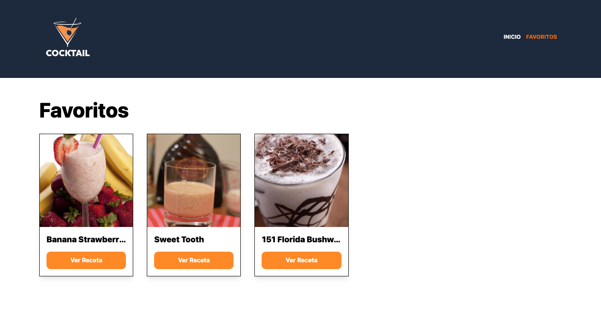
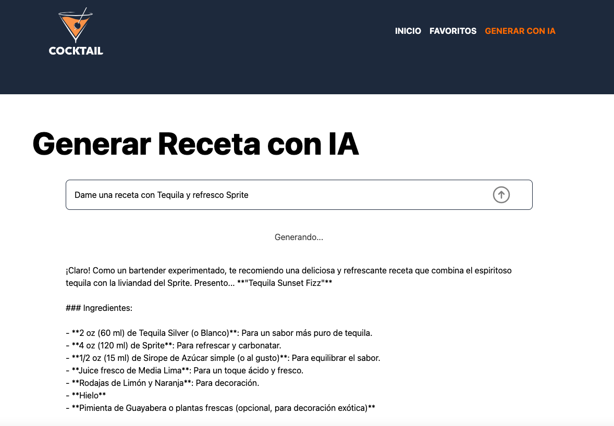

# Recipe Search
A recipe search engine to prepare different drinks, allowing you to save your favorites in a different section






## Technologies
React + Typescript + TailwindCSS + Zustand + React Router + API www.thecocktaildb.com + OpenRouter AI
## Deploy on Netlify
Website hosted on netlify.app server
[recipe-finder](https://recipe-finder-react-typescript.netlify.app/)
## Developer Notes
### Managed by Zustand in a Slice Pattern
#### src/stores/recipeSlice.ts
```
import type { StateCreator } from "zustand"
import { getCategories, getRecipeById, getRecipes } from "../services/RecipeService"
import type { Categories, Drink, Drinks, Recipe, SearchFilter } from "../types"
import type { FavoritesSliceType } from "./favoriteSlice"

export type RecipiesSliceType = {
    categories:Categories
    drinks: Drinks
    selectedRecipe: Recipe
    modal: boolean
    fetchCategories: () => Promise<void>
    searchRecipies: ( searchFilter: SearchFilter ) => Promise<void>
    selectRecipe: ( id: Drink['idDrink'] ) => Promise<void>
    closeModal : () => void
}

/* export const createRecipiesSlice : StateCreator<RecipiesSliceType & FavoritesSliceType, [], [], RecipesSliceType> = ( set ) => */

export const createRecipiesSlice : StateCreator<RecipiesSliceType & FavoritesSliceType, [],[] , RecipiesSliceType> = ( set ) => ({
    categories: {
        drinks:[]
    },
    drinks:{
        drinks:[]
    },
    selectedRecipe: {} as Recipe,
    modal: false,
    fetchCategories: async () => {
        const categories = await getCategories()
        set( { categories } ) 
    },
    searchRecipies: async ( filters ) => {
        const drinks = await getRecipes( filters )
        set( { drinks })
    },
    selectRecipe: async ( id ) => {
        const selectedRecipe = await getRecipeById( id )
        set( { selectedRecipe , modal:true } )
    },
    closeModal: () => {
        set( { modal : false , selectedRecipe : {} as Recipe } )
    }
})
```
#### src/stores/favoriteSlice.ts
```
import type { StateCreator } from "zustand";
import type { Recipe } from "../types";
import { createRecipiesSlice, type RecipiesSliceType } from "./recipeSlice";
import { createNotificationSlice, type NotificationSliceType } from './notificacionSlice';

export type FavoritesSliceType = {
    favorites: Recipe[]
    handleClickFavorite: ( recipe: Recipe ) => void
    favoriteExist: ( id: Recipe['idDrink'] ) => boolean
    loadLocalStorage: () => void
}

export const createFavoritesSlice : StateCreator<FavoritesSliceType & RecipiesSliceType & NotificationSliceType, [], [], FavoritesSliceType> = ( set , get , api ) => ({
    favorites:[],
    handleClickFavorite: (recipe) => {

        const exist = get().favoriteExist( recipe.idDrink )
        if( exist ){
            set( state => ({
                favorites: state.favorites.filter( favorite => favorite.idDrink !== recipe.idDrink )
            }) )
            createNotificationSlice(set,get,api).showNotification( { 
                text: 'Se eliminó de mis favoritos' , 
                error: false 
            } )
        }else{
            set( state => ({
                favorites: [ ...state.favorites , recipe ]
            }) )

            createNotificationSlice(set,get,api).showNotification( { 
                text: 'Se agregó a mis favoritos' , 
                error: false 
            } )

        }

        createRecipiesSlice(set, get ,api).closeModal()
        localStorage.setItem('favorites' , JSON.stringify( get().favorites ))
        
    },
    favoriteExist: ( id ) => {
        return get().favorites.some( favorite => favorite.idDrink === id )
    },
    loadLocalStorage: () => {
        const storeFavorites = localStorage.getItem( 'favorites' )
        if( storeFavorites ){
            set( { favorites: JSON.parse( storeFavorites ) } )
        }

    }
   
}) 
```
#### src/stores/notificationSlice.ts
```
import type { StateCreator } from "zustand"
import type { FavoritesSliceType } from "./favoriteSlice"

type Notification = {
    text: string
    error:boolean
    show: boolean
}

export type NotificationSliceType = {
   notification: Notification
   showNotification: ( payload: Pick<Notification, 'text' | 'error'> ) => void
   hiddeNotification: () => void
}

export const createNotificationSlice :  StateCreator<NotificationSliceType & FavoritesSliceType, [],[], NotificationSliceType> = ( set , get ) => ({
    notification:{
        text: '',
        error:false,
        show: false
    },
    showNotification: (payload) => {
        set({
            notification:{
                text: payload.text,
                error: payload.error,
                show: true
            }
        })
        setTimeout(() => {
            get().hiddeNotification()
        },2000)
    },
    hiddeNotification: () => {
        set({
            notification:{
                text: '',
                error: false,
                show: false
            }
        })
    }
})
```
### Managed by OpenRouter AI
#### src/services/AIService.ts
```
import { streamText } from 'ai'
import { openrouter } from '../lib/ai'

export default {
    async generateRecipe( prompt : string ){
        
        const result = streamText({
            model: openrouter('nvidia/llama-3.3-nemotron-super-49b-v1:free'),
            prompt,
            system:'Responde como un bartender experimentado',
            temperature: 1 // 0 -> respuesta exacta, 1 -> respuesta random
        })
        //console.log(result.textStream)
        return result.textStream
    }
}
```
